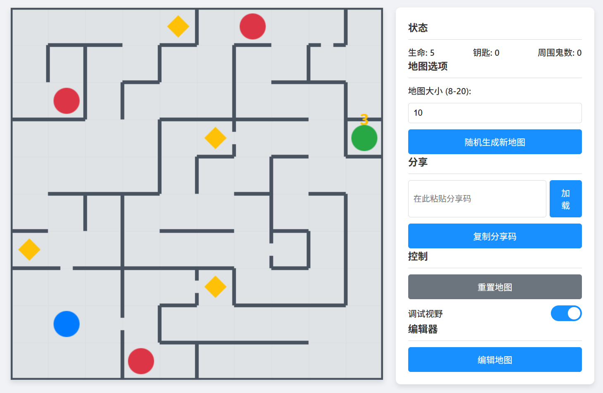

# 👻 鬼迷宫 (Ghost Maze)

欢迎来到鬼迷宫！这是一款结合了探索、解谜与生存元素的2D迷宫游戏。你不仅需要找到通往终点的路，还必须躲避在迷宫中游荡、会主动追捕你的鬼魂。游戏内置了强大的地图编辑器，让你能创造并分享属于你自己的挑战！

---

## ✨ 游戏特色

* **动态视野系统**: 战争迷雾笼罩着未知的区域，你只能看到已经探索过或在直线视野内的路径。
* **丰富的地图元素**: 不仅仅是墙壁，还有需要钥匙才能通过的门数字门，增加了策略维度。以后还会有更多元素加入！
* **内置地图编辑器**: 强大的可视化编辑器，让你像画画一样轻松创建、修改和测试自己的迷宫。
* **分享与挑战**: 将你精心设计的地图（或随机生成的地图）压缩成一串简短的分享码，发送给朋友，让他们来挑战你的杰作！
* **双端适配体验**: 无论在电脑还是手机上，都能获得流畅的游戏体验，移动端更有专属的虚拟方向键。

---

## 📜 游戏规则与玩法详解

### 🎯 核心目标

你的唯一目标是：**安全抵达迷宫中的绿色终点**。

### 🧩 迷宫元素

1. **玩家 (蓝色圆点)**
    * **生命 (HP)**: 你拥有初始5点生命值。每次被鬼抓住，你会损失1点生命并回到起点。当生命值降为0时，游戏结束。
    * **钥匙**: 你的初始钥匙数量为0。你需要探索迷宫，收集钥匙。

2. **视野与探索**
    * 游戏开始时，你只能看到你所在的初始房间。
    * 当你移动时，你走过的路径以及当前位置的直线无障碍视野范围都会被点亮。
    * 善用“调试视野”开关可以看清全图，但这会失去探索的乐趣！

3. **环境**
    * **墙壁**: 无法通过的障碍。
    * **门**: 可以自由通过。
    * **数字门 (带数字的墙)**: 必须拥有**等于或大于**数字门上所示数字的钥匙数量，才能通过。通过时不会消耗钥匙。
    * **钥匙 (黄色菱形)**: 走上去即可拾取，增加你的钥匙持有数量。
    * **终点 (绿色圆点)**: 游戏的目标，到达则胜利。

### 👻 敌人：鬼

1. **鬼 (红色圆点)**
    * 它们是迷宫中的主要威胁。
    * 鬼会在迷宫中移动，并且比你稍微“聪明”一点。

2. **触发追捕**
    * 鬼的AI核心是**直线视野**。如果一只鬼和你处于同一行或同一列，且中间没有任何墙壁或数字门阻挡，它就会“看到”你。
    * 一旦被看到，鬼会立刻将你数字门定为目标，并沿着最短路径向你冲来！
    * 如果你躲到墙壁后面，鬼会失去你的确切位置，但它仍会前往你最后出现的地方进行搜寻。

3. **危险警报**
    * 当有鬼进入你周围的九宫格范围时，游戏界面会变为**危险的红色**，同时状态栏的“周围鬼数”会更新。这是一个强烈的警告，告诉你必须立刻移动或改变策略！

4. **被捕后果**
    * 当鬼与你进入同一个格子时，你会被抓住。
    * 你会损失1点生命，并被传送回迷宫的初始房间。鬼也会留在原地。

---

## 🕹️ 操作指南

### 🖥️ 电脑端 (Desktop)

* **键盘移动**: 使用 `W`, `A`, `S`, `D` 键或 `↑`, `←`, `↓`, `→` 方向键进行移动。
* **鼠标移动**: 直接点击视野内任何**可到达**的格子，角色会自动寻路移动过去。

### 📱 移动端 (Mobile)

* **点击移动**: 与电脑端一样，可以点击视野内的格子进行自动寻路。
* **虚拟方向键 (D-Pad)**:
  * 屏幕右下角会显示一个虚拟方向键，点击或按住对应的方向即可移动。
  * **可以开关**: 在“控制”栏中，可以随时通过“方向按键”开关来显示或隐藏虚拟方向键。

---

## 🛠️ 地图编辑器

通过主界面的“编辑地图”按钮，你可以进入功能强大的地图编辑器。

* **切换工具**: 在顶部的工具栏选择你想要放置的元素。
* **放置/删除**:
  * **墙壁**: 按住并拖动鼠标/手指，可以连续绘制墙壁。再次点击或拖动已有的墙壁可以将其擦除。
  * **其他元素 (门、数字门、钥匙、鬼、终点等)**: 单击画布上的有效位置即可放置。再次单击已放置的元素可以将其移除。
  * **橡皮擦**: 可以擦除任何你放置的墙壁或实体。
* **游玩地图**: 编辑完成后，点击“游玩地图”即可立即开始测试你的创作。
* **清空/加载/分享**: 你可以清空整个地图，或通过分享码加载/复制你的编辑器作品。

---

## 🚀 如何运行

这是一个纯前端的单文件项目，无需任何服务器或复杂的配置。

1. 下载最新版本的游戏文件。
2. 用任何现代的网页浏览器（如 Chrome, Firefox, Edge, Safari）打开这个文件。
3. 开始愉快的游戏吧！
